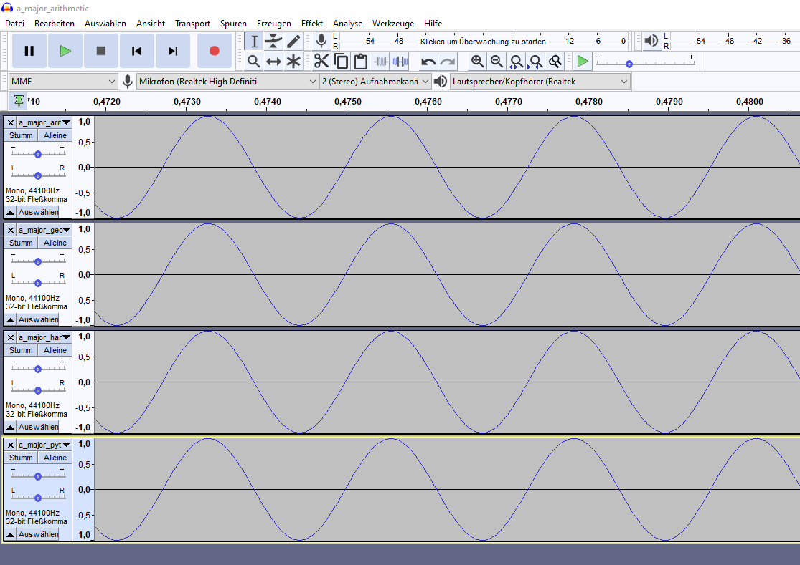
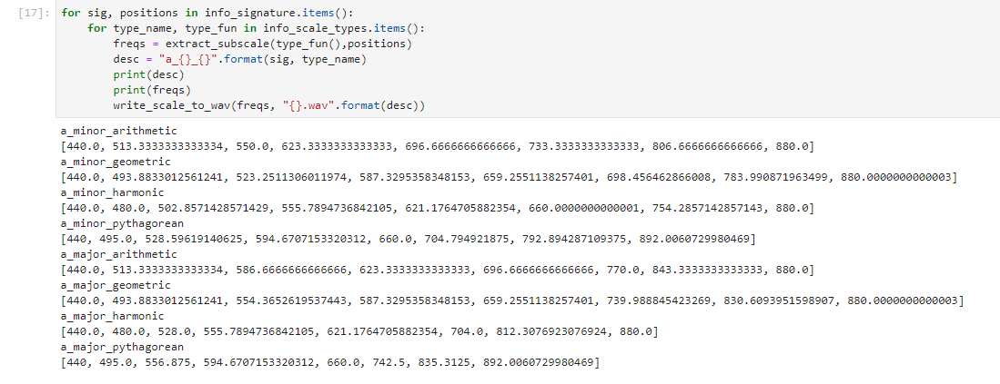

# generate-audio-scale
In the [Jupyter](https://jupyter.org/)-notebook ```create_wav_files.ipynb``` you can create audio-files in the wav-format with the following temperaments and scales.

**Temperaments**:
- **arithmetic** (i.e. subdivision of the octave into 13 tones according to an arithmetical sequence)
- **geometric**, also known as **equally tempered** (i.e. subdivision of the octave into 13 tones according to an geometric sequence)
- **harmonic** (i.e. subdivision of the octaveb into 13 tones according to a harmonic sequence)
- **pythagorean** (i.e. subdivision of the octaveb into 13 tones according to pure quints)

**Scales**:
- semitone
- major
- minor

# Installation and use:
- Download and install [Python 3](https://www.python.org/downloads/release/python-376/)
- Clone the repo with ```git clone https://github.com/jlieberherr/generate-audio-scale.git```
- Create a [virtual environment](https://realpython.com/python-virtual-environments-a-primer/)
- Install the required Python modules with ```pip install -r requirements.txt```
- Start Jupyter-lab with ```jupyter lab```
- Within Jupyter-lab open the notebook ```create_wav_files.ipynb``` and run the cells with ```Ctrl-Shift```
- Download [Audacity](https://www.audacity.de/)
- Open Audacity, drag and drop the created wav-files to Audacity and listen to the different scales

If you don't want to use the Jupyter notebook you can download the wav-files directly from [here](https://drive.google.com/drive/folders/190r2pg2BpIE9QSN1ib9yC-eWjaXFU45B?usp=sharing)

In Audacity it should look like this:


In the notebook ```create_wav_files.ipynb``` you can also get the underlying frequencies:

